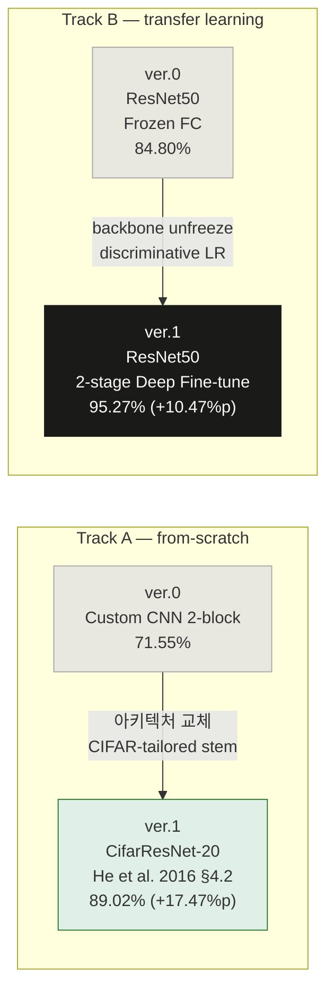

# PyTorch CNN 이미지 분류 실험 포트폴리오
## CIFAR-10 · 직접 설계 CNN vs 전이 학습 · 2버전 개선 기록


> CIFAR-10 (n=60,000, 10-class)을 대상으로 **접근법 A(직접 설계 CNN)** 와 **접근법 B(ResNet50 전이 학습)** 를
> **2개 버전**에 걸쳐 체계적으로 개선한 기록.
> ver.0의 실패 원인(Capacity 부족, Checkpoint 부재, 동결 backbone의 한계)을 진단하고,
> 아키텍처-데이터 정합성 확보 및 2-stage deep fine-tuning으로 최대 **+17.47%p** 를 달성하는 과정에 초점을 맞춘다.

---

## 목차

- [데이터셋 개요](#-데이터셋-개요)
- [실험 파이프라인](#-실험-파이프라인)
- [ver.0 — Baseline (Custom CNN + ResNet50 Frozen FC)](#ver0--baseline-custom-cnn--resnet50-frozen-fc)
- [ver.1 — Architecture Alignment + Deep Fine-tuning](#ver1--architecture-alignment--deep-fine-tuning)
- [전체 성능 비교](#-전체-성능-비교)
- [최종 결론](#-최종-결론)
- [핵심 학습](#-핵심-학습)
- [재현 방법](#-재현-방법)

---

## 📊 데이터셋 개요

| 항목 | 내용 |
|------|------|
| 출처 | `torchvision.datasets.CIFAR10` (Krizhevsky, 2009) |
| 전체 샘플 | 60,000장 (학습 50,000 / 테스트 10,000) |
| 이미지 크기 | 32 × 32 × 3 (RGB, uint8) |
| 클래스 수 | 10 (airplane, automobile, bird, cat, deer, dog, frog, horse, ship, truck) |
| 문제 유형 | 지도학습 — 다중 클래스 분류 (Supervised Multi-class Classification) |
| 데이터 분할 | Train 80% / Val 20% (stratified) + Test 고정 (`SEED=2023`) |

---

## 🔄 실험 파이프라인



---

## ver.0 — Baseline (Custom CNN + ResNet50 Frozen FC)

### 목적
CIFAR-10에서 (A) 처음부터 직접 설계한 얕은 CNN과 (B) ImageNet 사전학습 ResNet50의 기준 성능을 비교하고, 각 접근법의 구조적 한계를 파악한다.

### 아키텍처 A — Custom CNN

```
Input (B, 3, 32, 32)
  → Conv2d(3→32, k=3, s=1) → BN → ReLU → MaxPool(2,2)   # → 15×15×32
  → Conv2d(32→64, k=3, s=1) → BN → ReLU → MaxPool(2,2)  # → 6×6×64
  → Flatten(2304) → Dropout(p=0.3) → Linear(2304→10)
  → logits (B, 10)
```

| 항목 | 값 |
|------|----|
| 파라미터 수 | ~43K |
| 입력 해상도 | 32 × 32 (원본 유지) |
| 옵티마이저 | Adam (lr=1e-3) |
| 손실 함수 | CrossEntropyLoss (logits 입력) |
| 배치 크기 | 128 |
| 에포크 | 30 |
| 정규화 | 없음 (ToTensor만 적용) |
| Augmentation | RandomHorizontalFlip + RandomRotation(15°) + ColorJitter |

### 아키텍처 B — ResNet50 (Frozen Backbone)

```
ImageNet pretrained ResNet50 (IMAGENET1K_V2)
  → Backbone 전체 freeze  (requires_grad = False)
  → fc: Linear(2048 → 10)  ← 학습 파라미터 20,490개
```

| 항목 | 값 |
|------|----|
| 학습 파라미터 수 | 20,490 (fc 레이어만) |
| 입력 해상도 | 224 × 224 (32×32 → **7배 업스케일**) |
| 정규화 | ImageNet mean/std |
| 옵티마이저 | Adam (lr=1e-3) |
| 에포크 | 5 |

### 구현 특이사항

- **공유 학습 엔진:** `train_one_epoch` / `evaluate` / `fit` 함수를 두 모델이 공유 — 코드 중복 없음
- **데이터 경로 통일:** `CustomDataset + torchvision.transforms` 파이프라인으로 두 모델 모두 동일 분할 데이터 사용
- **CrossEntropyLoss 원칙:** Softmax/Sigmoid를 모델 내부에서 제거하고 logits 직접 전달

### 결과

| 모델 | Train Acc | Val Acc | **Test Acc** | Test Loss | 에포크 |
|------|-----------|---------|-------------|-----------|--------|
| Custom CNN | 72.81% | 71.89% | **71.55%** | 0.8583 | 30 |
| ResNet50 Frozen FC | 80.56% | 84.91% | **84.80%** | 0.4527 | 5 |

> **13.25%p 격차의 해석:**
> ResNet50이 **6배 적은 에포크로** CustomCNN보다 +13.25%p 우수했다.
> 단, 두 모델은 동일 해상도에서 비교된 것이 **아님**에 유의:
> Custom CNN은 32×32 원본을, ResNet50은 224×224로 강제 업스케일한 이미지를 사용.
> 따라서 이것은 아키텍처 성능의 순수 비교가 아니다.

### 관측된 한계 → ver.1 개선 방향

**Custom CNN 진단:**

- **Val acc 변동성 극심:** epoch 13 = 63.06% (저점) → epoch 25 = 75.14% (정점) → epoch 30 = 71.89% (종료). Train acc는 단조증가하지만 val acc가 ±5%p 범위에서 진동
- **Best-model checkpoint 부재:** 최적 지점(epoch 25, 75.14%) 대비 3.25%p 손실된 가중치로 test 평가
- **Capacity 부족(Underfitting):** train-val gap +0.92%p는 overfitting이 아닌 **underfitting 신호**. 2-block 얕은 구조로는 CIFAR-10의 복잡한 visual feature를 담기에 capacity가 부족

**ResNet50 진단:**

- **조기 종료:** val_loss가 에포크 5 종료 시점에도 0.6280 → 0.5270 → 0.4972 → 0.4782 → 0.4538으로 **단조 감소 중** → 아직 수렴 미완
- **LR scheduler 없음:** 학습률 고정(Adam 1e-3)으로 fine-tuning 후반 개선 여지 방치

**공통:**
- CIFAR-10 표준 augmentation(RandomCrop padding=4) 미적용
- Best-model checkpoint 없음 (마지막 epoch 가중치로 평가)

---

## ver.1 — Architecture Alignment + Deep Fine-tuning

### 목적
**접근법 A:** 입력 해상도 32×32를 그대로 유지하는 **CIFAR-tailored ResNet-20** (He et al. 2016 §4.2)으로 교체하여 아키텍처-데이터 정합성을 확보한다.

**접근법 B:** Frozen FC → **2-stage deep fine-tuning** (head warmup → full unfreeze + discriminative LR)으로 사전학습 feature의 domain adaptation을 극대화한다.

### 아키텍처 A — CifarResNet-20 (He et al. 2016)

```
Input (B, 3, 32, 32)
  → Stem: Conv2d(3→16, k=3, s=1, padding=1) → BN → ReLU   # → 32×32 (NO 7×7, NO MaxPool)
  → Stage1: 3 × BasicBlock(16→16, stride=1)                # → 32×32
  → Stage2: 3 × BasicBlock(16→32, stride=2)                # → 16×16
  → Stage3: 3 × BasicBlock(32→64, stride=2)                #  → 8×8
  → AdaptiveAvgPool2d(1) → Linear(64→10)
  → logits (B, 10)
```

논문 설계 원칙 (CIFAR-10 §4.2):
- depth = 6n+2 (ResNet-20: n=3, ResNet-32: n=5, ResNet-56: n=9, ResNet-110: n=18)
- **7×7 stem 제거, MaxPool 제거** → 32×32 공간 정보를 깊은 층까지 보존
- **Zero-init residual** (`bn2.weight=0`): 초기 잔차 branch를 identity로 시작 → 수렴 안정화 (He et al. 2019, Bag of Tricks)

| 항목 | 값 |
|------|----|
| 파라미터 수 | 272,474 |
| 입력 해상도 | 32 × 32 (원본 유지) |
| 정규화 | CIFAR-10 mean/std ([0.4914, 0.4822, 0.4465] / [0.2470, 0.2435, 0.2616]) |
| Augmentation | **RandomCrop(32, padding=4)** + RandomHorizontalFlip (CIFAR-10 표준) |
| 옵티마이저 | SGD (lr=0.1, momentum=0.9, nesterov=True, weight_decay=1e-4) |
| LR 스케줄러 | CosineAnnealingLR (T_max=60) |
| 에포크 | 60 |
| Checkpoint | Best val_loss 기준 저장 → test 평가 시 복원 |

### 아키텍처 B — ResNet50 Two-Stage Fine-tuning

```
Stage 1 — Head Warmup  (3 epochs)
  Backbone: frozen (requires_grad = False)
  FC head:  AdamW (lr=1e-3, weight_decay=1e-4)

Stage 2 — Deep Fine-tune  (10 epochs)
  Backbone: unfreeze, lr=1e-5  ← 기존 feature 보존을 위해 매우 낮게 설정
  FC head:  lr=1e-4              ← backbone보다 10× 높게
  Optimizer: AdamW (discriminative LR)
  Scheduler: CosineAnnealingLR (T_max=10)
  Checkpoint: Best val_loss 기준 저장
```

<details>
<summary><b>Discriminative LR 설계 근거</b></summary>

backbone은 ImageNet 학습으로 이미 수렴된 고품질 feature를 보유한다. 큰 LR로 업데이트하면 이 feature가 파괴(catastrophic forgetting)되므로, backbone에 head보다 10× 작은 lr을 부여하여 **새 도메인에 미세하게 적응**하면서도 기존 표현을 보존한다.

</details>

### 구현 특이사항

- **Best-model checkpoint:** `copy.deepcopy(model.state_dict())`로 val_loss 기준 최적 가중치 저장, 학습 종료 후 복원
- **Two-stage helper:** `two_stage_finetune()` 함수가 Stage 1 best state를 Stage 2 시작점으로 이어받아 연속성 보장
- **`build_discriminative_optimizer()`:** `head_prefix`로 레이어를 분기하여 backbone / head에 다른 lr 적용하는 범용 함수
- **CIFAR 정규화 vs ImageNet 정규화 분리:** `normalize="cifar"` / `"imagenet"` 파라미터로 경로별 정규화 명시적 분리

### 결과

| 모델 | **Test Acc** | 에포크 | Δ vs ver.0 | Best val_loss epoch |
|------|-------------|--------|------------|---------------------|
| CifarResNet-20 | **89.02%** | 60 | **+17.47%p** | epoch 54 |
| ResNet50 deep FT | **95.27%** | 3+10=13 | **+10.47%p** | Stage 2 내 |

**ver.0 → ver.1 개선 원인 분석:**

| 개선 요인 | 접근법 A | 접근법 B |
|----------|---------|---------|
| 아키텍처 | 2-block → 20층 CifarResNet | 동일 (ResNet50) |
| 학습 전략 | from-scratch (SGD+Nesterov) | Frozen FC → 2-stage deep FT |
| 데이터 정합성 | 32×32 유지 + CIFAR norm | 224×224 유지 + ImageNet norm |
| LR 전략 | Cosine schedule 추가 | Discriminative LR + Cosine |
| Checkpoint | Best val_loss 저장 | Best val_loss 저장 |
| Augmentation | CIFAR 표준 RandomCrop 추가 | 동일 |

### 진단 상세

<details>
<summary><b>CifarResNet-20 상세 진단</b></summary>

- **Cosine annealing 효과:** epoch 35 이후 LR이 0.04 이하로 감소하며 val 곡선 안정화. Best val_loss가 epoch 54에 달성 → 60 epoch 전반에 걸쳐 의미 있는 학습 지속
- **Overfitting 신호:** Final train acc 98.44% vs val acc 90.20% → gap **8.24%p**. ver.0 Custom CNN의 +0.92%p와 극명한 대조 → capacity가 충분해지면서 비로소 overfitting이 가능해진 것
- **Best vs Final 수렴:** epoch 54 (val_acc 0.9013) vs epoch 60 (val_acc 0.9020)의 차이가 매우 작음 → Cosine schedule 후반부가 사실상 학습을 멈추기 때문. Checkpoint의 실질 이득은 이 경우 제한적
- **Val-Test 간극 1.31%p:** ver.0의 0.34%p 대비 확대. val_loss 기준 best 선택 과정에서 val에 일정 정도 적응한 신호 가능성

</details>

<details>
<summary><b>ResNet50 Deep Fine-tune 상세 진단</b></summary>

- **Stage 2 전환 효과:** Stage 1 종료 val_acc 82.69% → Stage 2 첫 epoch val_acc 90.55% → **단일 epoch에 +7.86%p**. Frozen backbone이 CIFAR에 충분히 적응하지 못했던 표현이 즉시 활성화됨
- **Generalization gap 매우 작음:** Final train acc 97.69% vs val acc 95.12% → gap **2.57%p**. CifarResNet의 8.24%p와 대조적 → **ImageNet pretrained feature가 강한 regularizer 역할**
- **학습 여지 잔존:** Stage 2 종료 시 val_loss가 여전히 미세하게 단조 감소 중 → `T_max=15` 이상으로 늘리면 추가 개선 기대 가능
- **Val < Test 역전:** Final val_acc 95.12% vs Test 95.27% → test가 0.15%p 더 높음 (data split 무작위성 + 정규화 효과)

</details>

---

## 📈 전체 성능 비교

### Test Accuracy 추이

```
Custom CNN  (ver0, 30ep)          ████████████████████████████████████████     71.55%
ResNet50 Frozen FC (ver0, 5ep)    █████████████████████████████████████████████████  84.80%
CifarResNet-20 (ver1, 60ep)       █████████████████████████████████████████████████████  89.02%
ResNet50 Deep FT (ver1, 3+10ep)   ███████████████████████████████████████████████████████████  95.27%
```

### 파라미터 효율성 (ver.1 기준)

| 모델 | Test Acc | 파라미터 수 | 에포크 | Acc/M params |
|------|----------|------------|--------|--------------|
| CifarResNet-20 | 89.02% | 272,474 | 60 | **3.27** |
| ResNet50 deep FT | 95.27% | 23,528,522 | 13 | 0.041 |

> ResNet50은 **86배 많은 파라미터**로 6.25%p 우위.
> 파라미터 효율성 기준으로는 **CifarResNet-20이 ~70배 우수.**
> 리소스 제약 환경에서는 CifarResNet 계열이 실용적 선택이다.

### 버전별 최고 성능 요약

| 버전 | 접근법 A (from-scratch) | 접근법 B (전이 학습) | 주요 변경 사항 |
|------|------------------------|---------------------|---------------|
| ver.0 | 71.55% | 84.80% | Baseline |
| ver.1 | **89.02% (+17.47%p)** | **95.27% (+10.47%p)** | 아키텍처 교체 + 2-stage fine-tuning |

> **A의 개선폭(+17.47%p)이 B(+10.47%p)보다 더 큰 이유:**
> ver.0 Custom CNN은 구조 자체의 결함(입력 크기 불일치, Capacity 부족)이 복합적으로 작용했기 때문이다.
> 반면 ResNet50은 ver.0에서도 이미 ImageNet feature의 힘을 일부 발휘하고 있었다.

---

## 🔬 최종 결론

### 1. 아키텍처와 입력 해상도의 정합성이 성능의 출발점이다

Custom CNN (71.55%) → CifarResNet-20 (89.02%)의 +17.47%p 향상은 단순히 층을 더 쌓는 것이 아니라, **아키텍처를 데이터 특성에 맞게 설계**하는 것의 중요성을 보여준다.

CIFAR-10의 32×32 이미지에 ImageNet용 7×7 stride-2 stem + MaxPool을 그대로 적용하면 입력 단계에서 공간 정보가 과도하게 압축된다. He et al. §4.2의 CIFAR-tailored stem(3×3 s=1, no MaxPool)은 이 문제를 아키텍처 레벨에서 원천 해결한다.

### 2. 전이 학습의 진짜 효과는 '동결'이 아닌 '적응'에서 나온다

ResNet50 frozen FC (84.80%) → deep fine-tuning (95.27%)의 +10.47%p 향상은, backbone을 그대로 동결하는 것이 얼마나 많은 성능을 방치하는지 보여준다. Stage 2 첫 epoch에서만 +7.86%p가 달성된 것은, **frozen 상태의 backbone이 CIFAR의 저해상도 특성에 충분히 적응하지 못했음**을 의미한다.

단, backbone LR을 head보다 10× 낮게(1e-5 vs 1e-4) 유지하는 discriminative LR은 필수적이다. 큰 LR로 업데이트하면 ImageNet feature가 파괴(catastrophic forgetting)된다.

### 3. 두 접근법의 실용적 지위

| 목표 | 권장 접근법 | 근거 |
|------|------------|------|
| 리소스·지연시간 제약 | CifarResNet 계열 | 파라미터 효율 ~70배 우수 |
| 최고 성능 | ResNet50 deep FT | 13 ep으로 95.27% |
| 소량 데이터 + 새 도메인 | 전이 학습 (deep FT) | pretrained feature가 강한 regularizer |
| 도메인 특화 아키텍처 연구 | CIFAR-tailored 설계 | 입력 크기–stem–pooling 정합성 |

---

## 💡 핵심 학습

### 1. Capacity 부족은 정규화가 아니라 아키텍처로 해결한다
ver.0 Custom CNN의 train-val gap +0.92%p는 underfitting 신호였다. 이 상태에서 Dropout이나 weight decay를 더 추가하면 오히려 성능이 하락한다. **정규화 이전에 모델이 데이터를 충분히 학습할 capacity를 갖추었는지 먼저 확인해야 한다.**

### 2. Best-model checkpoint는 선택이 아니라 필수다
ver.0 CustomCNN은 epoch 25에 val_acc 75.14%를 달성했지만, epoch 30 가중치(71.89%)로 test를 평가했다. **3.25%p의 성능을 방치**한 셈이다. Checkpoint의 구현 비용은 `copy.deepcopy(model.state_dict())` 한 줄이다.

### 3. 아키텍처 설계는 입력 해상도부터 시작한다
ImageNet용 모델을 CIFAR에 그대로 쓰는 것은 "격자 구조가 다른 운동장에서 같은 경기 규칙을 적용하는 것"이다. stem의 kernel size, stride, 첫 pooling 계층은 **입력 해상도에 맞게 설계**되어야 하며, 이것이 아키텍처 커스터마이징의 시작점이다.

### 4. Frozen backbone은 프로토타입이지 최종 모델이 아니다
frozen FC는 사전학습 모델의 feature 품질을 빠르게 확인하는 방법으로 유효하다. 그러나 최종 성능을 목표로 한다면 backbone도 반드시 fine-tuning해야 한다. 핵심은 backbone LR을 매우 낮게(1e-5 수준) 유지하여 **기존 feature를 보존하면서 새 도메인에 적응**시키는 것이다.

### 5. Val accuracy의 진동은 LR scheduler 부재의 신호다
ver.0 CustomCNN의 val acc가 ±5%p로 진동했다. ver.1에서 CosineAnnealingLR을 추가하자 epoch 35 이후 val 곡선이 뚜렷하게 안정화되었다. **from-scratch 학습에서 LR decay는 수렴 안정성의 핵심**이며, 스케줄러 없는 고정 LR은 후반부 fine-grained 수렴을 방해한다.

### 6. Train-val gap이 커지는 것은 반드시 나쁜 신호가 아니다
ver.0 Custom CNN: train-val gap +0.92%p (underfitting). ver.1 CifarResNet-20: gap 8.24%p (overfitting 가능 상태). **gap이 커졌다는 것은 모델이 비로소 데이터를 충분히 학습할 수 있는 capacity를 갖게 됐음을 의미**한다. 과적합을 줄이는 것은 그 다음 단계(MixUp, CutMix, depth 증가 시 weight decay 강화 등)에서 다룰 문제다.

---

## 재현 방법

```bash
# 의존성 설치
pip install torch torchvision scikit-learn numpy pillow matplotlib
```

```bash
# ver.0 실행 (Custom CNN + ResNet50 frozen FC)
python cifar10_cnn_transfer_learning_ver0.py

# ver.1 실행 (CifarResNet-20 + ResNet50 deep fine-tuning)
python cifar10_cnn_transfer_learning_ver1.py
```

**공통 재현성 설정 (모든 버전 적용):**

```python
import os, random
import numpy as np
import torch

def set_seed(seed: int = 2023) -> None:
    random.seed(seed)
    np.random.seed(seed)
    torch.manual_seed(seed)
    torch.cuda.manual_seed_all(seed)
    torch.backends.cudnn.deterministic = True
    torch.backends.cudnn.benchmark = False
    os.environ["PYTHONHASHSEED"] = str(seed)

SEED = 2023
set_seed(SEED)
device = torch.device("cuda" if torch.cuda.is_available() else "cpu")
```

**데이터 분할 (모든 버전 동일):**

```python
from sklearn.model_selection import train_test_split

x_train, x_val, y_train, y_val = train_test_split(
    x_full, y_full,
    test_size=0.2,
    random_state=2023,
    stratify=y_full,
)
# Train: 40,000 / Val: 10,000 / Test: 10,000 (torchvision 고정)
```

**ver.1 주요 Config:**

```python
@dataclass
class Config:
    # CifarResNet
    cifar_resnet_depth: int = 20          # 20 / 32 / 56 / 110 (6n+2 조건)
    epochs_cifar:       int = 60
    lr_cifar:           float = 0.1       # SGD initial LR (논문 기본값)
    weight_decay_cifar: float = 1e-4

    # ResNet50 two-stage fine-tuning
    epochs_warmup:      int   = 3         # Stage 1: head only
    epochs_finetune:    int   = 10        # Stage 2: full unfreeze
    lr_head_warmup:     float = 1e-3      # Stage 1 head LR
    lr_backbone_ft:     float = 1e-5      # Stage 2 backbone LR (매우 낮게)
    lr_head_ft:         float = 1e-4      # Stage 2 head LR
    weight_decay_ft:    float = 1e-4
```

---

*PyTorch CNN Image Classification · CIFAR-10 · SEED=2023 · CUDA T4 · ver.0 – ver.1*
