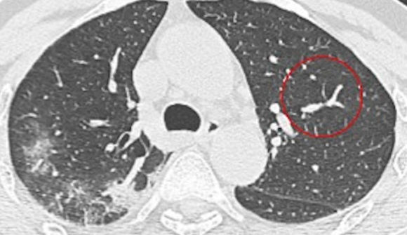
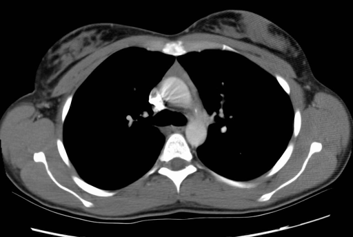

# CNN-Based Medical Image Diagnosis: COVID-19 CT Classification

본 저장소(Repository)는 LAIDD '의료이미지 기반 환자진단 및 바이오마커 탐색' 과정의 실습 결과물을 정리한 프로젝트입니다[: 7]. 합성곱 신경망(CNN)을 활용하여 COVID-19 및 Non-COVID CT 이미지를 분류하는 워크플로우를 구현하였습니다[: 7].

## 1. 프로젝트 및 데이터 개요
* **데이터셋:** COVID-CT-Dataset (A CT Image Dataset about COVID-19)[: 7].
* **데이터 전처리:** 이미지를 224x224 해상도로 조정 및 정규화(Normalize)하였으며, 학습 데이터에는 RandomResizedCrop 및 RandomHorizontalFlip 기법을 적용하여 데이터 증강(Data Augmentation)을 수행하였습니다[: 7].

### CT 이미지 데이터 예시 (Sample Data)
| COVID-19 CT | Non-COVID CT |
| :---: | :---: |
|  |  |
| 실제 코로나19 양성 환자의 CT 흉부 이미지 | 정상(음성) 환자의 CT 흉부 이미지 |

---

## 2. 모델 아키텍처 및 실습 워크플로우

본 실습은 모델의 구조를 점진적으로 개선하는 3단계의 파이프라인으로 구성되어 있습니다.

### Step 1. Baseline Model (`1_1_Covid19_CT_CustomCNN_Baseline.ipynb`)
* COVID-19 CT 이미지 분류를 위한 초기 기준점(Baseline) 모델 환경 및 전처리 과정을 구축하였습니다[: 5].

### Step 2. Deeper Residual CNN (`1_2_Covid19_CT_DeeperResCNN_Improvement.ipynb`)
* **잔차 연결(Residual Block):** 네트워크 깊이에 따른 학습 저하를 방지하기 위해 Skip Connection을 도입하였습니다[: 6].
* **전역 평균 풀링(Global Average Pooling):** 공간 해상도를 1x1로 압축하는 `AdaptiveAvgPool2d`를 적용하여 파라미터 수를 128개로 줄이고 과적합을 방지하였습니다[: 6].
* **하이퍼파라미터 튜닝:** `Optuna` 라이브러리를 활용하여 학습률(Learning Rate), 가중치 감쇠(Weight Decay), 드롭아웃(Dropout) 비율을 최적화하였습니다[: 6].
* **조기 종료(Early Stopping):** 검증 손실(Validation Loss)을 기준으로 모델 학습을 조기 종료하는 로직을 적용하였습니다[: 6].

### Step 3. Feature Fusion Network (`1_3_Covid19_CT_FeatureFusion_Final_Pipeline.ipynb`)
* **특징 융합(Feature Fusion):** 대규모 데이터로 사전 학습된 `ResNet50` 모델과 맞춤형 특징 추출기(`CustomFeatureExtractor`)를 결합한 `CombinedCovidNet`을 설계하였습니다[: 7].
* **분류기 구조:** ResNet50의 특징 2048개와 맞춤형 모델의 특징 128개를 병합(`torch.cat`)하여 총 2176개의 특징 벡터를 구성한 뒤 최종 분류기(`Linear`)에 입력되도록 처리하였습니다[: 7].
* **학습 및 튜닝:** `Optuna`의 `MedianPruner`를 활용해 10회의 모의 탐색을 진행하여 하이퍼파라미터를 찾고, 이를 바탕으로 최대 30 에포크(Patience 10) 동안 최종 학습을 수행하였습니다[: 7].

---

## 3. 평가 결과 및 분석 (Evaluation)

### 3.1. 평가지표 (Metrics)
최종 모델(`CombinedCovidNet`)을 테스트 데이터셋으로 평가한 결과는 다음과 같습니다[: 7].
* **검증(Validation) 성능:** 정확도(Accuracy) 80.3%, 민감도(Sensitivity) 78.6%, 특이도(Specificity) 81.9%, ROC Score 0.887[: 7].
* **테스트(Test) 성능:** 정확도 80.3% 수준을 유지하였으며, 테스트 셋의 실제 코로나 환자 105명 중 86명을 정확히 분류하여 민감도 81.9%, 특이도 78.6%를 기록하였습니다[: 7].

### 3.2. 혼동 행렬 (Confusion Matrix)
테스트 셋에 대한 혼동 행렬 판정 건수는 다음과 같습니다[: 7].
* **진양성 (TP, True Positive):** 86건 (코로나 환자를 코로나로 진단)[: 7].
* **진음성 (TN, True Negative):** 77건 (정상인을 정상으로 진단)[: 7].
* **위양성 (FP, False Positive):** 21건 (정상인에게 코로나로 오진)[: 7].
* **위음성 (FN, False Negative):** 19건 (코로나 환자를 정상으로 오진)[: 7].

### 3.3. 한계점 및 향후 개선 방향
* 융합 모델 적용을 통해 두 클래스에 대한 예측 균형이 안정화되었습니다[: 7].
* 하지만 의료 진단 데이터의 특성상 위음성(False Negative, 19건)은 질병을 놓치는 치명적인 지표입니다[: 7].
* 이를 개선하기 위해 모델의 분류 임계값(Threshold)을 현행 50%에서 30%~40% 수준으로 하향 조정하여, 민감도를 더욱 높이고 위음성 비율을 낮추는 후처리 기법 적용이 요구됩니다[: 7].